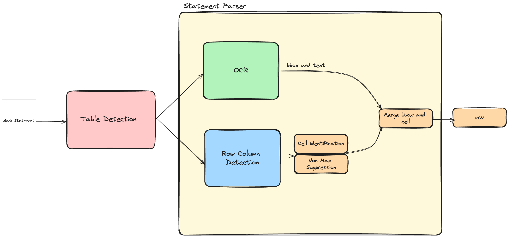

# BankAIAgent

The BankAIAgent is designed to be a assistant for your personal finances. Keeping a record of past financial transactions enable us to make better financial decisions, such as identifying recurring payments and cutting those costs, budgeting, and bucketing transactions into categories. Most banks today provide a downloadable csv format for your past transaction histories, which could help us analyze our financials; however, when it comes to businesses who recieve bank statements as supported documents, analyzing these documents are often resorted to manual labor. Therefore, this project aims to bridge that gap, and provides a tool to parse and analyze bank statements.

## Getting Started
1. Instal the required libraries via `pip install -r requirements.txt`.
2. Go to `src/main.py` and open the file, and you'll see:
    ```python
    from parser.statement_parser import StatementParser

    bs_parse = StatementParser()
    bs_parse.bankstatement2csv(pdf='path/to/your/bank-statement.pdf')
    ```
    - Set the path to your pdf document, and run the python file via `python3 main.py` and you'll generate an `output.xlsx` file with the extracted transactions.
- **Note**: Currently this model performs well with Bank of America and Chase bank since the models used for this projects were finetuned on those statements.

### Problem Statement
Most banks present their statements in a tabular format with transactions detailed in some chronological format.Therefore, parsing bank statements can be defined as a combination of Table Detection and Table Structure Detection problem. More specifically, we need a system capable of identifying tables within these statements, and then detecting those transactions. And since each transaction is laid out in a row and columnar fashion, we'll need a model that is capable of identifying rows and columns. For this project, we'll use Microsoft's Table Transformer model to solve these problems. 



[More updates to come]